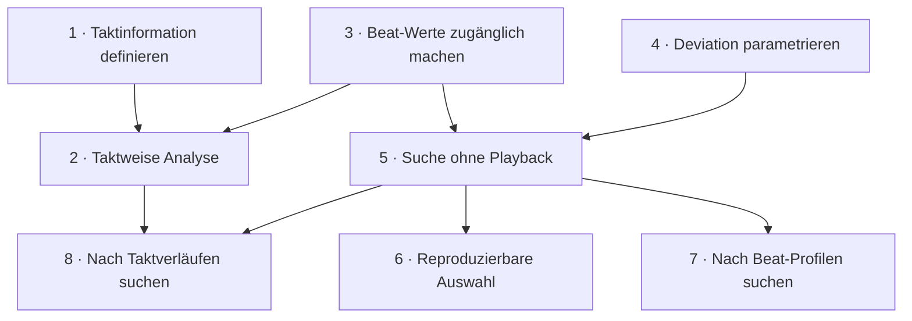

# Projektentwurf: Rhythmisches Informationsmaß musikalisch nutzbar machen

Status: lokaler Arbeitsentwurf, noch nicht in Vikunja angelegt.
Herkunft: [PV-1](http://localhost:3456/tasks/1).
Fachliche Grundlage: [Schwächen und Zielbild](../schwaechen-und-zielbild.md).
Stand der Entwürfe: 19. September 2026.

Die acht Entwürfe sind fortlaufend von 1 bis 8 nummeriert. Dies sind lokale
Referenzen. Projektkennung, reale Ticket-IDs, Zuständigkeiten und Termine
werden erst bei einer späteren Übernahme festgelegt. Die Titel und Inhalte
der einzelnen Dateien sind als Grundlage für Vikunja-Tasks formuliert.

## Projektziel

Das vorhandene Informationsmaß wird als musikalisches Arbeitsmittel
zugänglich: Informationsgrad wählen, Deviation einstellen, Verteilung auf
Zählzeiten und nach fachlicher Klärung auf Takte untersuchen, Kandidaten
ansehen und eine nachvollziehbare Auswahl an die bestehende Wiedergabe übergeben.

Reproduzierbarkeit unterstützt diesen Ablauf. Speichern von
Informationsverläufen als Presets ist kein Bestandteil des Kernziels.
Das bestehende Informationsmaß wird nicht nebenbei verändert.

## Ergebnisse und Etappen

**Erster nutzbarer Stand:** Beat-Information sichtbar, Deviation einstellbar,
Kandidaten ohne Playback auffindbar und die Auswahl reproduzierbar.
Die ausgewählten Onsets werden ausgegeben. Die noch offene
Taktdefinition blockiert diesen Stand nicht.

**Fachlicher Kernabschluss:** Zusätzlich ist Taktinformation definiert,
die beschlossene taktweise Analyse implementiert und die Suche nach
zeitlicher Informationsverteilung nutzbar.

## Taskübersicht

| Lokaler Entwurf | Titel | Quelle | Abhängigkeiten |
| --- | --- | --- | --- |
| [1](tasks/entwurf-1.md) | Den Taktinformationsbegriff fachlich bestimmen | S2 | keine |
| [2](tasks/entwurf-2.md) | Taktweise Analyse gemäß fachlicher Definition umsetzen | S2 | 1,3 |
| [3](tasks/entwurf-3.md) | Beat-Informationswerte öffentlich zugänglich machen | S1 | keine |
| [4](tasks/entwurf-4.md) | Deviation als Parameter der Informationssuche anbieten | S3 | keine |
| [5](tasks/entwurf-5.md) | Informationssuche ohne Wiedergabe bereitstellen | S4, S3 | 3,4 |
| [6](tasks/entwurf-6.md) | Zufallsauswahl reproduzierbar und sichtbar machen | S4 | 5 |
| [7](tasks/entwurf-7.md) | Nach Beat-Profilen und Informationsmaxima suchen | S5 | 5 |
| [8](tasks/entwurf-8.md) | Nach mehrtaktigen Informationsverläufen suchen | S5, S2 | 2,5 |

Die Nummerierung ist keine Rangfolge. Aufgeführt sind nur unmittelbare
Abhängigkeiten: Die Umsetzung benötigt ein konkretes Ergebnis des Vorgängers.
Mittelbare Voraussetzungen werden nicht ein zweites Mal aufgeführt. Reine
Koordination wird separat benannt, damit keine unnötigen Blockaden entstehen.

## Abhängigkeiten

Pfeile zeigen von einer Voraussetzung zum Folgetask. Indirekte
Abhängigkeiten sind im Diagramm nicht zusätzlich eingezeichnet.
Task 2 benötigt sowohl 1 als auch 3; Task 5 sowohl 3 als auch 4;
Task 8 sowohl 2 als auch 5.

## Empfohlene Bearbeitung

1. Entwürfe 3 und 4 sind unabhängig umsetzbar. Entwurf 1 beginnt daneben
   als fachliche Klärung.
2. Entwurf 5 folgt auf 3 und 4. Danach folgen 6 für reproduzierbare
   Auswahl und 7 für die zeitliche Suchdimension innerhalb eines Takts.
3. Erst nach abgestimmtem Ergebnis von 1 folgt 2; darauf baut 8 auf.
   Eine Entscheidung für zwei Taktkontexte wird nicht vorausgesetzt.

Die allgemeinen Qualitätsregeln stehen nicht in einem zusätzlichen
„Tests verbessern“-Task. Jede Umsetzung trägt ihre eigenen fachlichen
Beispiele und geeigneten Prüfungen.

## Abdeckung der Schwächen

| Schwäche | Zuständiger Entwurf |
| --- | --- |
| S1 – Beat-Werte nicht zugänglich | 3 |
| S2 – Taktinformation und taktweise Analyse | 1 (Begriff), 2 (Umsetzung) |
| S3 – Deviation fest verdrahtet | 4 |
| S4 – Suche, Auswahl und Playback gekoppelt | 5, 6 |
| S5 – Keine zeitliche Informationssuche | 7 (Beat), 8 (Taktverlauf) |
| S6 – Direkte Wiedergabe fehlt | Außerhalb dieses Projektumfangs |
| S7 – Katalog und Analysewerte instabil | Außerhalb dieses Projektumfangs |
| S8 – Beschränkte Positionszahlen und Taktbildung | Außerhalb dieses Projektumfangs |

S3 bleibt die Parametrisierung eines bereits vorhandenen skalaren Kriteriums.
S5 führt eine andere Suchdimension ein: die zeitliche Verteilung derselben
Information. Weder Onset-Dichte noch metrische Gewichtung ersetzt das Maß.

## Projekt-Akzeptanzkriterien für den fachlichen Kern

- [ ] Die bestehenden Kennzahlen bleiben kompatibel und die Werte je
  Zählzeit sind öffentlich zugänglich.
- [ ] Deviation ist explizit einstellbar; Such- und Kompatibilitätsdefaults
  sind dokumentiert.
- [ ] Die Kandidatensuche ist ohne Auswahl und Playback bedienbar; eine
  Auswahl kann per Dry-run geprüft werden, und vor dem Playback wird genau
  die an die Wiedergabe übergebene Auswahl angezeigt.
- [ ] Ausgewählte Onsets werden ausgegeben; ein Seed hat einen klar
  begrenzten Reproduzierbarkeitsvertrag.
- [ ] Der Taktinformationsbegriff ist fachlich abgestimmt; die daraus
  abgeleitete Taktanalyse und Taktverlaufsuche entsprechen den Beispielen.
- [ ] Beat-Profile unterscheiden Rhythmen gleicher Gesamtinformation.
- [ ] Normale Tests benötigen keine reale MIDI-Hardware. DB-Verhalten wird
  in einer getrennten Testdatenbank verifiziert.
- [ ] Die öffentlichen Änderungen sind in CLI-Hilfe, Completion und
  Benutzerdokumentation gemeinsam nachvollzogen.

## Festlegungen, offene Entscheidungen und zurückgestellte Ideen

- **Taktinformation:** Entwurf 1 entscheidet die Bedeutung und benötigte
  Modi. Entwürfe 2 und 8 sind bis dahin konditionale Umsetzungsvorschläge.
- **Deviation-Defaults:** Entwurf 4 legt als Kompatibilitätsvertrag fest,
  dass alte Playback-Aufrufe weiterhin strikt `> 0.7` verwenden und
  explizite inklusive Grenzen diesen Default vollständig ersetzen.
- **Profilformen:** konstant, steigend, fallend, alternierend und gipfelförmig
  bleiben spätere Erweiterungen. Entwurf 7 beschränkt sich auf exakte
  Beat-Profile und die Position eines Informationsmaximums.
- **Weitere Onset-Filter und Zielprofil-Distanzen:** mögliche spätere
  Ergänzungen, noch kein konkreter Implementierungsauftrag.
- **Dateiablage und Presets:** kein Bestandteil dieser Tasks.
- **Direkte Wiedergabe, Katalogpflege und Taktbildungsforschung:** S6, S7 und S8
  bleiben dokumentiert, werden mit diesem Projekt aber nicht bearbeitet.

Die zuvor gestrichenen Themen werden nicht als eigenständige Tasks
wiedereingeführt: keine Mapping-Neuentwicklung, allgemeine
Validierungsbereinigung, Architektur-Neufassung, Variationswerkzeuge oder
Exportfunktionen. Notwendige Eingabeprüfung und Tests bleiben Bestandteil
der jeweils angefassten Funktion.

## Hinweise für die spätere Übernahme

Jede Datei enthält Titel, Ziel, Umfang, Akzeptanzkriterien, Abgrenzung und
Verifikation. Bei der Übernahme werden lokale Abhängigkeiten auf die neu
vergebenen Vikunja-IDs abgebildet. Die fachliche Begriffsaufgabe bleibt
von den darauf aufbauenden Implementierungsaufgaben unterscheidbar.
Die genaue Befehlsnotation ist ein Entwurf und wird nicht allein durch
Übernahme eines Tasks zur implementierten CLI.

Diese Planung legt keine Vikunja-Daten an und verändert keine Checkboxen
von PV-1. Die README-Verweise auf laufende Entwürfe bleiben unverändert.
